## Step 1: Create a new react app

```
npx create-react-app demo-cypress --template typescript
```

```
yarn create react-app demo-cypress --template typescript
```

### Change directory

```
cd demo-cypress
```

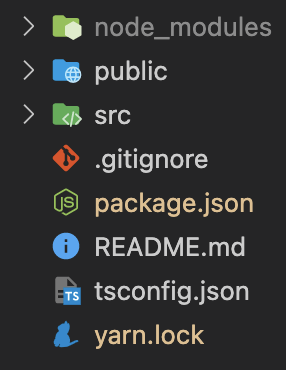

## Step 2: Install cypress related modules

```
npm install cypress @cypress/react --save-dev
```

```
yarn add -D cypress @cypress/react
```

- tested with `"@cypress/react": "^6.0.0", "cypress": "^10.4.0"`

## Step 3: Open Cypress

### If running the first time, you might need to verify first

```
npm run cypress verify
```

```
yarn run cypress verify
```

### Open cypress to setup configurations

```
npm run cypress open
```

```
yarn run cypress open
```

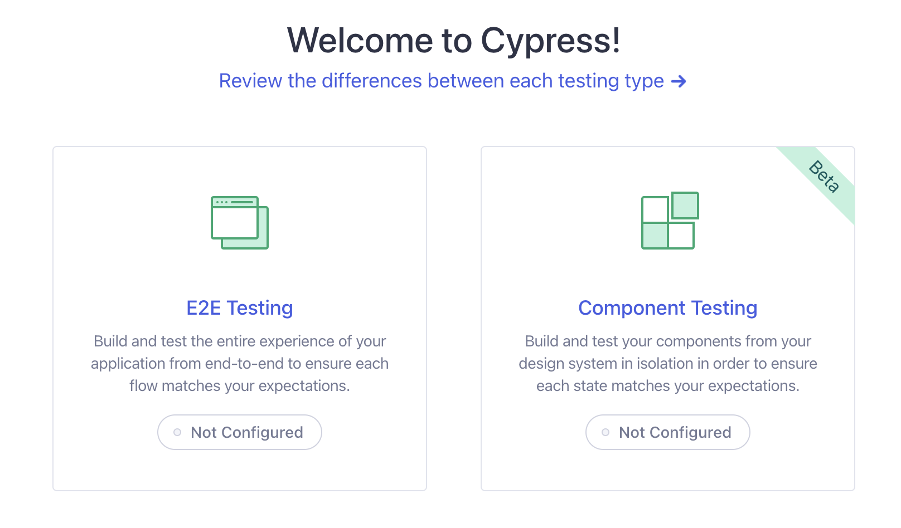

## Step 4: Click on `Component Testing` to setup basic configs

### Select frontend framework type

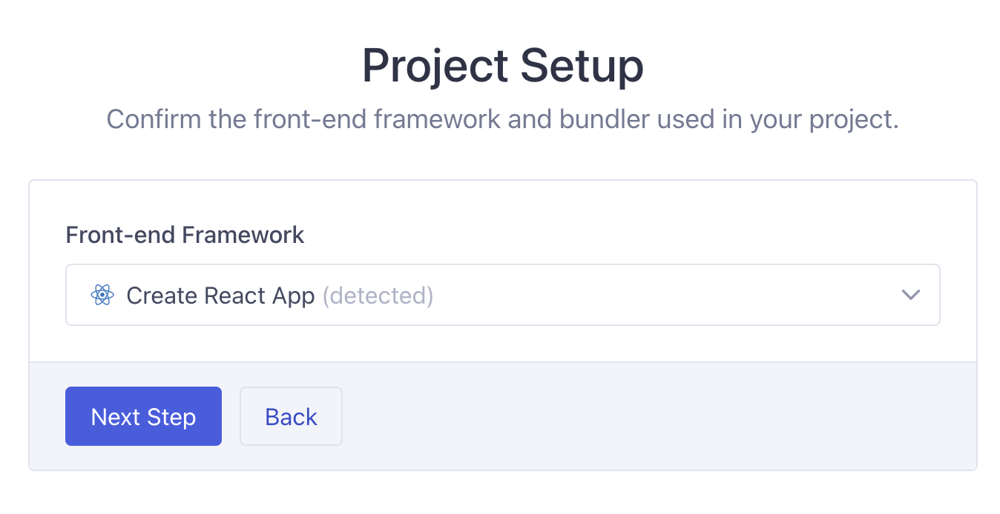

### Install dev dependencies

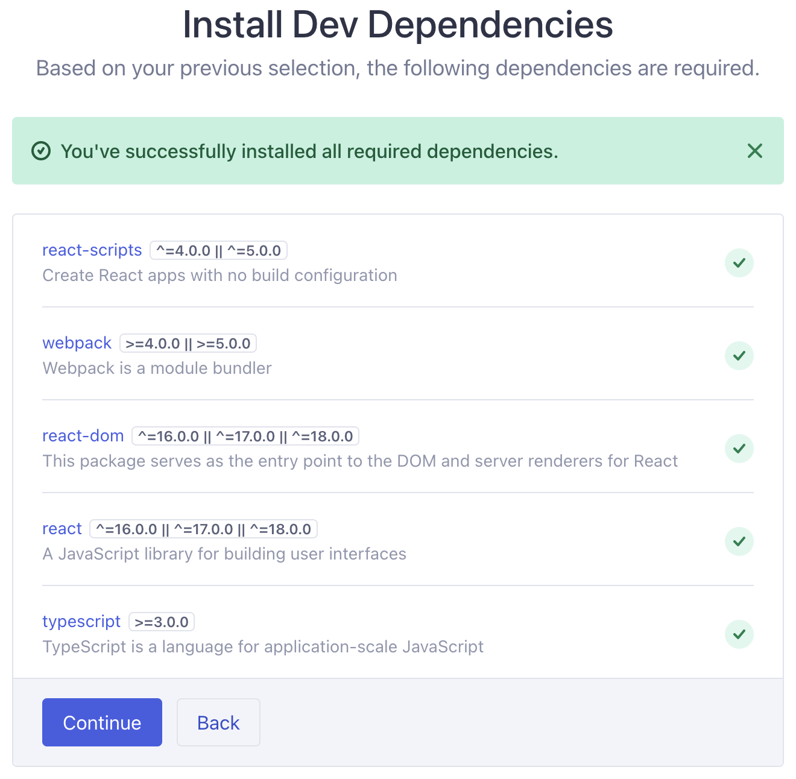

### Auto generate configuration files

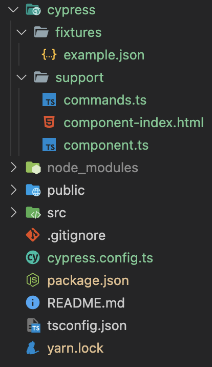

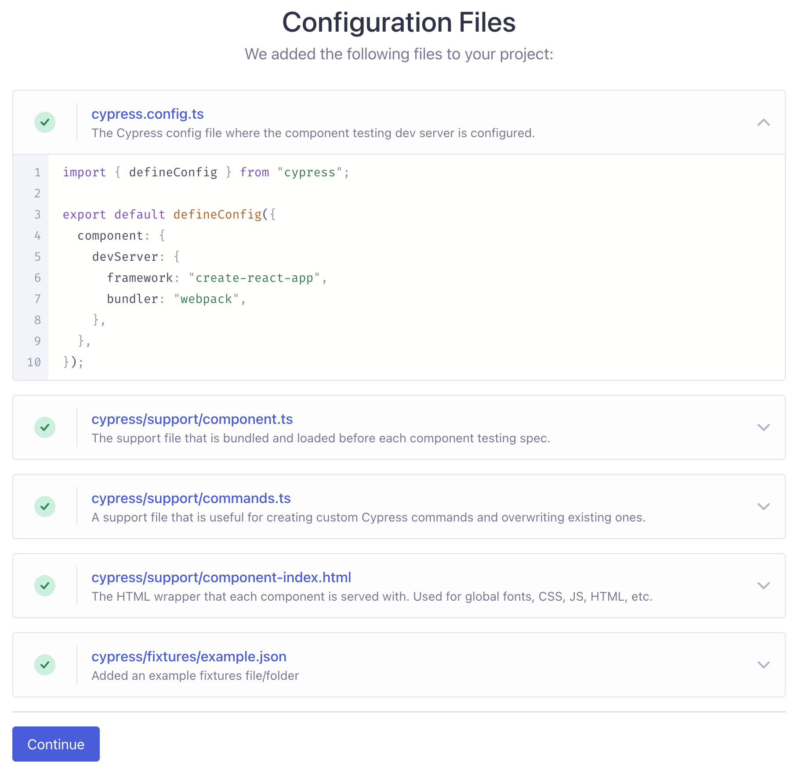

### Choose browser type

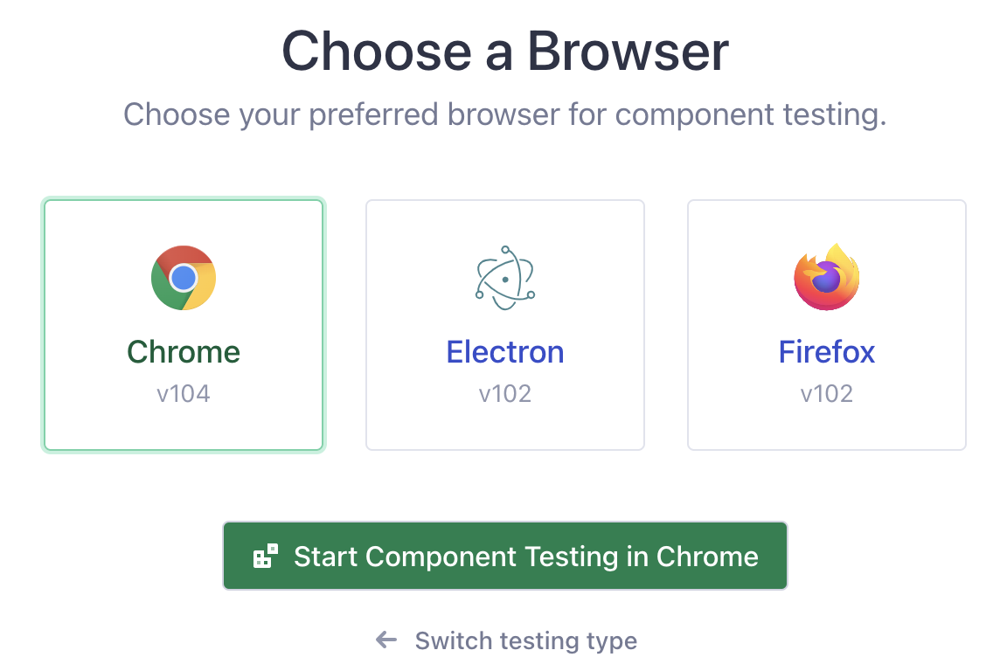

## Step 5: Create new test file

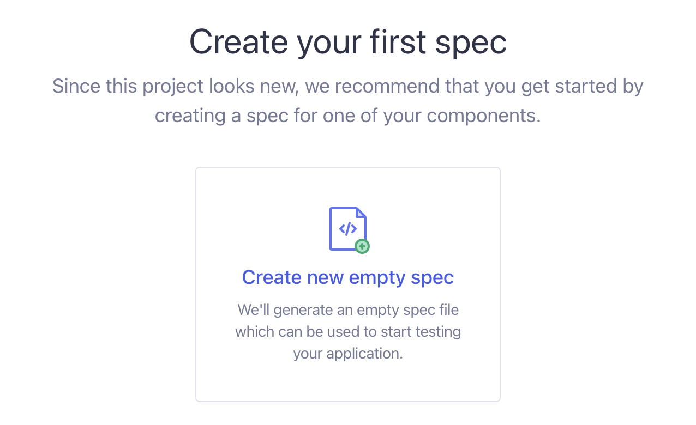

### Create test file with desired name

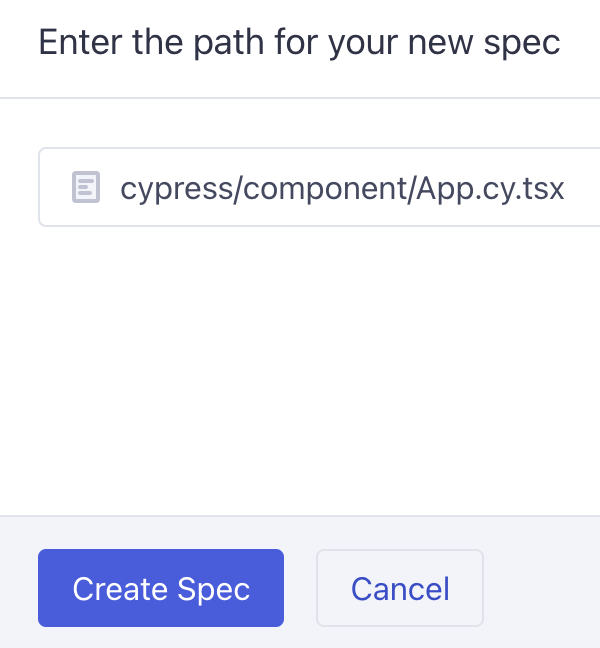

### New file will be auto generated

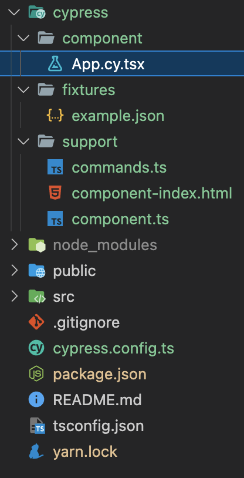

### Run the test or create a new test file

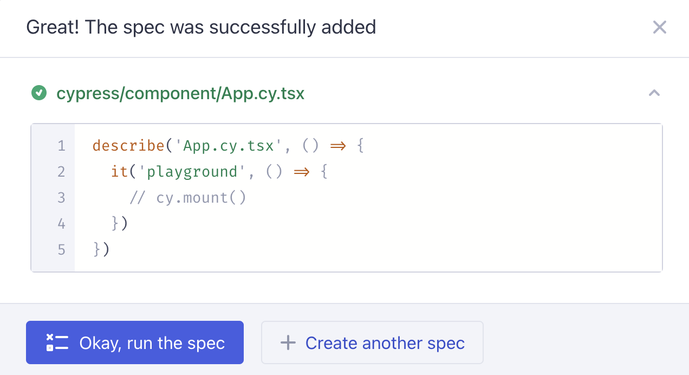

## Step 6: Modify the test file

### Initial test code

```ts
describe("App.cy.tsx", () => {
  it("playground", () => {
    // cy.mount()
  });
});
```

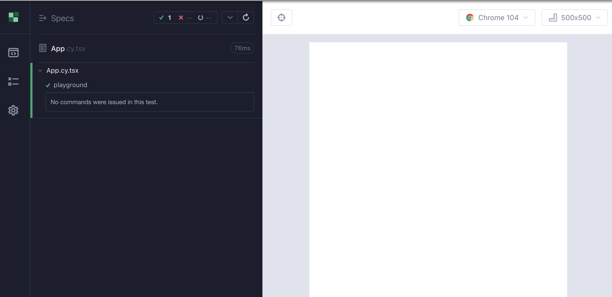

### New passing sample test code

```ts
import * as React from "react";
import App from "../../src/App";
import {mount} from "@cypress/react";

it("renders react app", () => {
  mount(<App />);
  cy.contains(/learn react/i).should("be.visible");
});
```

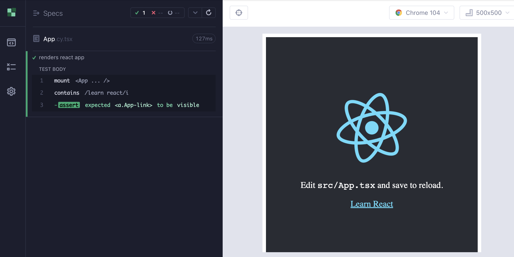

### Failing sample test code

```ts
import * as React from "react";
import App from "../../src/App";
import {mount} from "@cypress/react";

it("renders react app", () => {
  mount(<App />);
  cy.contains(/learn react not working/i).should("be.visible");
});
```

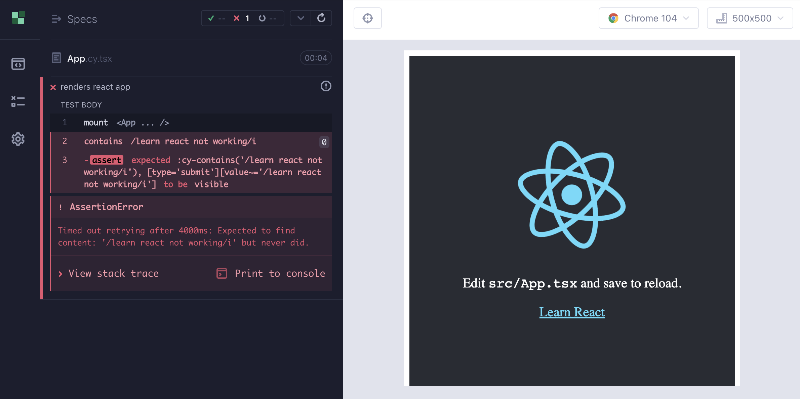
