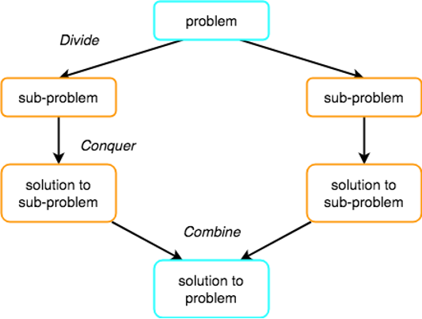

# Divide & Conquer

- We can choose from a wide range of algorithm design techniques
  - For insertion sort, we used an incremental approach
    - having sorted the subarray A[1 .. j-1], we inserted the single element A[j] into its proper place, yielding the sorted subarray A[1 .. j]
- an alternative design approach, known as `divide-and-conquer`
  - We use divide-and-conquer to design a sorting algorithm
    - whose worst-case running time is much less than that of insertion sort
    - One advantage of divide-and-conquer algorithms is that their running times are often easily determined
- Many useful algorithms are recursive in structure

  - to solve a given problem, they call themselves recursively one or more times to deal with closely related sub-problems
  - These algorithms typically follow a divide-and-conquer approach
    - they break the problem into several subproblems that are similar to the original problem but smaller
    - solve the subproblems recursively
    - then combine these solutions to create a solution to the original problem

  

## algorithm

- The divide-and-conquer paradigm involves 3 steps at each level of the recursion

  1.  `Divide` the problem into a number of subproblems that are smaller instances of the same problem
  2.  `Conquer` the subproblems by solving them recursively
      - If the subproblem sizes are small enough, however, just solve the subproblems in a straightforward manner
  3.  `Combine` the solutions to the subproblems into the solution for the original problem

- another method of explanation

  1.  Divide problem into several smaller subproblems
      - normally, the subproblems are similar to the original
  2.  Conquer the subproblems by solving them recursively
      - base case: solve small enough problems by brute force
  3.  Combine the solutions to get a solution to the subproblems
      - and finally a solution to the original problem
  4.  Divide and Conquer algorithms are normally [recursive](https://github.com/reshinto/Basic_technologies_revision/tree/master/algorithms_and_techniques/recursion)
