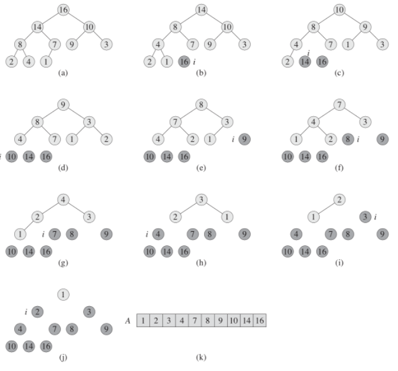

# Heap Sort

- For the heap sort algorithm, we use max-heaps
- Based on the Heap data structure, we can build a sort algorithm called heap sort
  - We have to build our heap from some dataset, and then starting from the first element we put it in the first place and reduce the length with our heap, it remains in the array, but it is not part of the heap
  - Thus, each time we rebuild our heap the array will be sorted
  - each time the array is sorted the array becomes smaller
  - heap sort is thus executed for `O(n log n)`
- The heap sort algorithm starts by using buildMaxHeap to build a max-heap on the input array `A[1..n]`
  - where `n = A.length`
  - Since the maximum element of the array is stored at the root `A[1]`, we can put it into its correct final position by exchanging it with `A[n]`
  - If we now discard node n from the heap
    - we can do so by simply decrementing `A.heapSize`
    - we observe that the children of the root remain max-heaps
      - but the new root element might violate the max-heap property
      - All we need to do is to restore the max-heap property
        - however, it calls maxHeapify, which leaves a max-heap in `A[1..n-1]`
        - The heap sort algorithm then repeats this process for the max-heap of size n - 1 down to a heap of size 2
- The heap sort procedure takes time `O(n log n)`
  - since the call to buildMaxHeap takes time `O(n)`
  - and each of the n - 1 calls to maxHeapify takes time `O(log n)`
- example

  - We take the first element and remove it from the heap when we put it first in the array
  - The tree is automatically rebuilt, now we take the first one again and put it in second place, and so on
    - until the heap ceases to exist and our array is completely sorted

  
