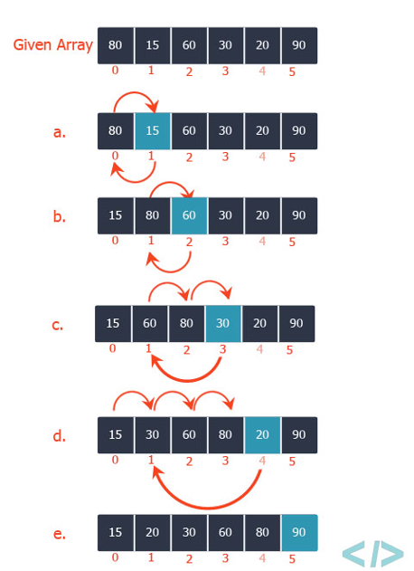

# Insertion Sort

- it is a simple sorting algorithm that works similar to the way you sort playing cards in your hands

  - The array is virtually split into a sorted and an unsorted part
  - Values from the unsorted part are picked and placed at the correct position in the sorted part

- The running time of the insertionSort procedure depends on the set of input values

  - it takes longer to sort thousands of numbers than to sort three numbers
  - the running time of the algorithm increases with an increase in the amount of input data
    - it is a common practice to represent the running time of a program as a function depending on the number of input elements
    - For this, the concepts of "algorithm time" and "size of input data" need to be determined more precisely

- The most adequate concept of input data size depends on the problem in question

  - For each task considered below, the way of measuring the size of the input data will be indicated
  - In the case of insertion sort, the number of input elements is considered as the size of the input data

- The running time of an algorithm on a particular input is the number of primitive operations or "steps" executed

  - It is convenient to define the notion of step so that it is as machine-independent as possible

- To sort an array of size n in ascending order

  - Iterate from arr[1] to arr[n] over the array
  - Compare the current element (key) to its predecessor
  - If the key element is smaller than its predecessor, compare it to the elements before
    - Move the greater elements one position up to make space for the swapped element

  

- example

  ```ts
  // prettier-ignore
  function insertionSort(numbers: number[]) {       // Cost | Repeats
    for (let i = 1; i < numbers.length; i++) {      // c[1] | n
      const numberToSort = numbers[i];              // с[2] | n-1
      let j = i - 1;                                // с[3] | n-1
  
      while (j >= 0 && numbers[j] > numberToSort) { // c[4] | Sum(j=2, n) t[j]
        numbers[j + 1] = numbers[j];                // c[5] | Sum(j=2, n) t[j-1]
        j--;                                        // c[6] | Sum(j=2, n) t[j-1]
      }
  
      numbers[j + 1] = numberToSort;                // с[7] | n-1
    }
  }

  const numbers = [1, 600, 199, 20, 7, 6, 8, 1300, 12, 601];

  insertionSort(numbers);

  console.log(numbers);
  ```
