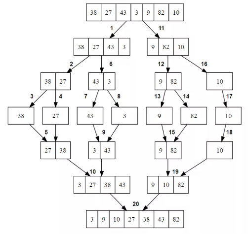

# Merge Sort

- The merge sort algorithm closely follows the divide-and-conquer paradigm

  1.  `Divide` the n-element sequence to be sorted into two subsequences of n/2 elements each
  2.  `Conquer`: Sort the two subsequences recursively using merge sort
  3.  `Combine`: Merge the two sorted subsequences to produce the sorted answer

  

- example

  - We take half the length of the array and divide it into two parts
    - And we call the merge function to the same sorting from the left and right sides
    - The merge function itself compares and merges our sequences
  - Although the code for merge sort works correctly when the number of elements is not even, our recurrence-based analysis is simplified if we assume that the original problem size is a power of 2
    - Each divide step then yields two subsequences of size exactly n/2
    - This assumption does not affect the order of growth of the solution to the recurrence
  - We reason is to set up the recurrence for T(n), the worst-case running time of merge sort on n numbers
    - Merge sort on just one element takes constant time
    - When we have n > 1 elements, we break down the running time as follows:
      - `Divide`: The divide step just computes the middle of the subarray, which takes constant time
        - Thus, D(n) = Θ(1)
      - `Conquer`: We recursively solve two subproblems, each of size n/2, which contributes 2T(n/2) to the running time
      - `Combine`: We have already noted that the MERGE procedure on an n-element subarray takes time Θ(n), and so C(n) = Θ(n)

  ```ts
  function merge(left: number[], right: number[]) {
    const result = [];
    const leftLength = left.length;
    const rightLength = right.length;
    let leftIndex = 0;
    let rightIndex = 0;

    while (leftIndex < leftLength && rightIndex < rightLength) {
      if (left[leftIndex] < right[rightIndex]) {
        result.push(left[leftIndex++]);
      } else {
        result.push(right[rightIndex++]);
      }
    }

    while (leftIndex < leftLength) {
      result.push(left[leftIndex++]);
    }

    while (rightIndex < rightLength) {
      result.push(right[rightIndex++]);
    }

    return result;
  }

  function mergeSort(numbers: number[]): number[] {
    const length = numbers.length;
    const mid = Math.floor(length * 0.5);
    const left = numbers.slice(0, mid);
    const right = numbers.slice(mid, length);

    if (length === 1) {
      return numbers;
    }

    return merge(mergeSort(left), mergeSort(right));
  }

  console.log(mergeSort([1, 600, 199, 20, 7, 6, 8, 1300, 12, 601]));
  ```
