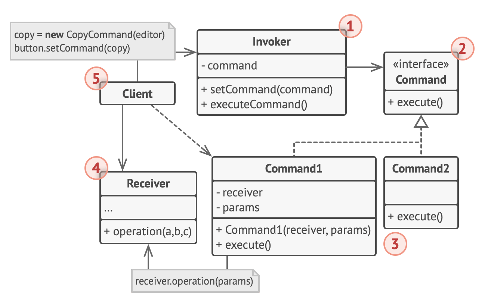

# Command

- The Command pattern aims to encapsulate method invocation, requests, or operations into a single object
- It gives us the ability to both parameterize and pass method calls around that can be executed at our discretion
- It enables us to decouple objects invoking the action from the objects that implement them, giving us a greater degree of overall flexibility in swapping out concrete classes (objects)
- idea behind the Command pattern is that it provides us a means to separate the responsibilities of issuing commands from anything executing commands, delegating this responsibility to different objects instead

## Why use the Command pattern

- By using the command pattern in our programs and applications, we are able to incorporate functionalities (such as queueing, request logging, and undo/redo operations) with a lot of ease
- This is because each request is an independent entity from other classes and objects
- therefore, we can modify or update a request without worrying about affecting other requests or objects

## Analogy

### in a restaurant

- the Client is the customer
- the Invoker is the waiter that writes the paper order that is given from the client
- the waiter then gives the paper orders as a form of command to the chefs in the kitchen
- the receiver is the chefs in the kitchen that takes the command and then prepares the meal

## Structure



1. The Sender class (aka invoker) is responsible for initiating requests.
   - This class must have a field for storing a reference to a command object.
   - The sender triggers that command instead of sending the request directly to the receiver.
   - Note that the sender isn’t responsible for creating the command object.
   - Usually, it gets a pre-created command from the client via the constructor.
2. The Command interface usually declares just a single method for executing the command.
3. Concrete Commands implement various kinds of requests.
   - A concrete command isn’t supposed to perform the work on its own, but rather to pass the call to one of the business logic objects.
   - However, for the sake of simplifying the code, these classes can be merged.
4. Parameters required to execute a method on a receiving object can be declared as fields in the concrete command.
   - You can make command objects immutable by only allowing the initialization of these fields via the constructor.
5. The Receiver class contains some business logic.
   - Almost any object may act as a receiver.
   - Most commands only handle the details of how a request is passed to the receiver, while the receiver itself does the actual work.
6. The Client creates and configures concrete command objects.
   - The client must pass all of the request parameters, including a receiver instance, into the command’s constructor.
   - After that, the resulting command may be associated with one or multiple senders.

## When to apply

- when you want to parametrize objects with operations
  - The Command pattern can turn a specific method call into a stand-alone object
  - This change opens up a lot of interesting uses: you can pass commands as method arguments, store them inside other objects, switch linked commands at runtime, etc.
  - example: you're developing a GUI component such as a context menu, and you want your users to be able to configure menu items that trigger operations when an end user clicks an item
- when you want to queue operations, schedule their execution, or execute them remotely
  - As with any other object, a command can be serialized, which means converting it to a string that can be easily written to a file or a database
  - Later, the string can be restored as the initial command object
  - Thus, you can delay and schedule command execution
  - In the same way, you can queue, log or send commands over the network
- when you want to implement reversible operations
  - Although there are many ways to implement undo/redo, the Command pattern is perhaps the most popular of all
  - To be able to revert operations, you need to implement the history of performed operations
  - The command history is a stack that contains all executed command objects along with related backups of the application's state
  - This method has two drawbacks
    - First, it isn't that easy to save an application's state because some of it can be private
      - This problem can be mitigated with the Memento pattern
    - Second, the state backups may consume quite a lot of RAM
  - Therefore, sometimes you can resort to an alternative implementation
    - instead of restoring the past state, the command performs the inverse operation
  - The reverse operation also has a price
    - it may turn out to be hard or even impossible to implement

## Pros and Cons

| pros                                                                                                         | cons                                                                                                          |
| ------------------------------------------------------------------------------------------------------------ | ------------------------------------------------------------------------------------------------------------- |
| decoupling classes that invoke operations from classes that perform these operations (Single Responsibility) | the code may become more complicated since you're introducing a whole new layer between senders and receivers |
| introducing new commands into the app without breaking existing client code (Open/Closed)                    |                                                                                                               |
| implementing undo/redo                                                                                       |                                                                                                               |
| implementing deferred execution of operations                                                                |                                                                                                               |
| assembling a set of simple commands into a complex one                                                       |                                                                                                               |

## Example

```ts
abstract class Command {
  protected app: Application;
  protected editor: Editor;
  protected backup: string;

  constructor(app: Application, editor: Editor) {
    this.app = app;
    this.editor = editor;
  }

  saveBackup() {
    this.backup = this.editor.text;
  }

  undo() {
    this.editor.text = this.backup;
  }

  abstract execute();
}
```

```ts
class CopyCommand extends Command {
  execute() {
    this.app.clipboard = this.editor.getSelection();
  }
}
class PasteCommand extends Command {
  execute() {
    this.saveBackup();
    this.editor.replaceSelection(this.app.clipboard);
  }
}
class CommandHistory {
  private history: Command[];

  push(c: Command) {
    this.history.push(c);
  }
  pop(): Command {
    return this.history[this.history.length - 1];
  }
}
class Editor {
  text: string;

  getSelection() {
    return "some selection";
  }
  replaceSelection(clipboard) {
    return `some ${clipboard} selection`;
  }
}
```

```ts
class Application {
  clipboard: string;
  editor: Editor;
  activeEditor: Editor;
  history: CommandHistory;

  bindComands() {
    shortcuts.onkeypress("Ctrl+C", () => {
      return this.executeCommand(new CopyCommand(this, this.editor));
    });
    shortcuts.onkeypress("Ctrl+V", () => {
      return this.executeCommand(new PasteCommand(this, this.editor));
    });
  }

  executeCommand(command: Command) {
    this.history.push(command);
    command.execute();
  }

  undo() {
    const command = this.history.pop();
    command.undo();
  }
}
```
