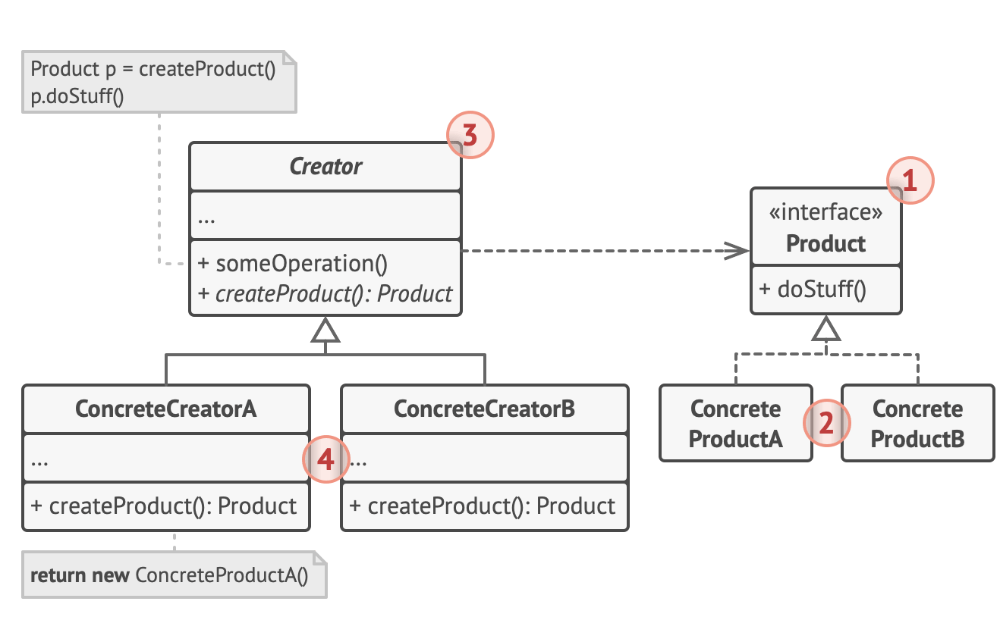

# Factory

- it is an interface for creating an object which lets subclasses decide which class to instantiate
- also know as the virtual constructor pattern

## Analogy

- assume a phone in an elementary form has
  - a model name, processor type, amount of RAM, dimensions, screen resolutions
- a phone factory can manufacture all kinds of phones
  - only need to supply a combination of feature attributes to get the job done
  - once a combinations of specs listed as model A, B, and C are available
    - do not need to specify the specs again
- in conclusion, the factory pattern allows generation of preconfigured custom objects easily
  - without the need to pass in constructor options each time

## Structure

1. The Product declares the interface, which is common to all objects that can be produced by the creator and its subclasses.

2. Concrete Products are different implementations of the product interface.

3. The Creator class declares the factory method that returns new product objects.

   - It’s important that the return type of this method matches the product interface.
   - You can declare the factory method as abstract to force all subclasses to implement their own versions of the method.
   - As an alternative, the base factory method can return some default product type.
   - Note, despite its name, product creation is not the primary responsibility of the creator.
   - Usually, the creator class already has some core business logic related to products.
   - The factory method helps to decouple this logic from the concrete product classes.
   - Here is an analogy: a large software development company can have a training department for programmers.
   - However, the primary function of the company as a whole is still writing code, not producing programmers.

4. Concrete Creators override the base factory method so it returns a different type of product.
   - Note that the factory method doesn’t have to create new instances all the time.
   - It can also return existing objects from a cache, an object pool, or another source.

## Summary

- factory pattern provides an interface for constructing pre-configured objects
- code is cleaner and resilient
- pattern is useful when writing packages for public use
- allows an easy to understand interface to the package functions
