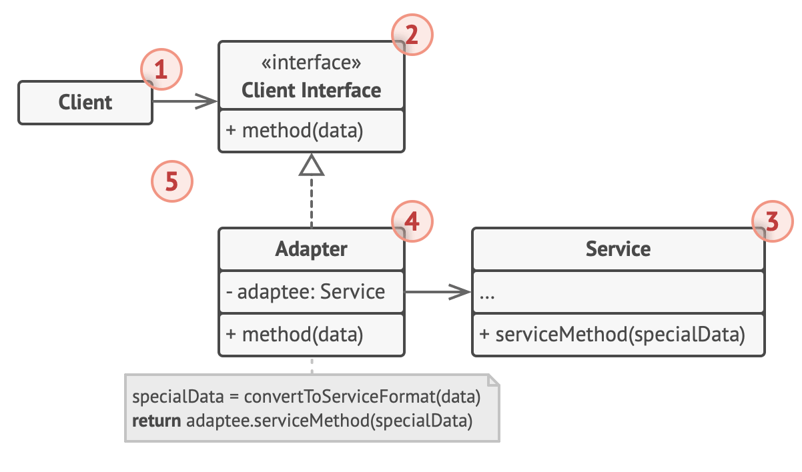

# Adapter design pattern

- original definition
  - Convert the interface of a class into another interface clients expect
  - Adapter lets classes work together that couldn't otherwise because of incompatible interfaces
- Adapters help mitigate incompatibilities between interfaces by adapting 1 interface to another

## When to use

- Make old component usable in a new system
- Make an "off-the-shelf" solution usable in a system that is not fully compatible
- example
  - if we are using a class, and a consumer is using the methods
  - then we need to switch from the current class to a better class
    - the better class offers a different interface and will require the client code to be refactored to use it
    - migration will not be easy, especially if it is a large enterprise app where methods are deeply integrated and extensively used
  - will need a decoupled solution which is easy to implement and does not involve refactoring as much as possible
    - by using the adapter pattern, refactoring can be minimized
    - done by mapping methods from better class to how our clients expects
  - the adapter helps the consumer adapt to a new interface by using the pattern

## Structure

1. The Client is a class that contains the existing business logic of the program.

2. The Client Interface describes a protocol that other classes must follow to be able to collaborate with the client code.

3. The Service is some useful class (usually 3rd-party or legacy).

   - The client can’t use this class directly because it has an incompatible interface.

4. The Adapter is a class that’s able to work with both the client and the service: it implements the client interface, while wrapping the service object.

   - The adapter receives calls from the client via the adapter interface and translates them into calls to the wrapped service object in a format it can understand.

5. The client code doesn’t get coupled to the concrete adapter class as long as it works with the adapter via the client interface.
   - Thanks to this, you can introduce new types of adapters into the program without breaking the existing client code.
   - This can be useful when the interface of the service class gets changed or replaced: you can just create a new adapter class without changing the client code.

## Summary

- the adapter pattern is used to create a bridge between 2 different interfaces
- removes incompatibilities between the interfaces
- prevents or minimizes refactoring client application code
- lets you build packages with an opinionated API, with custom adapters for maximum compatibility
