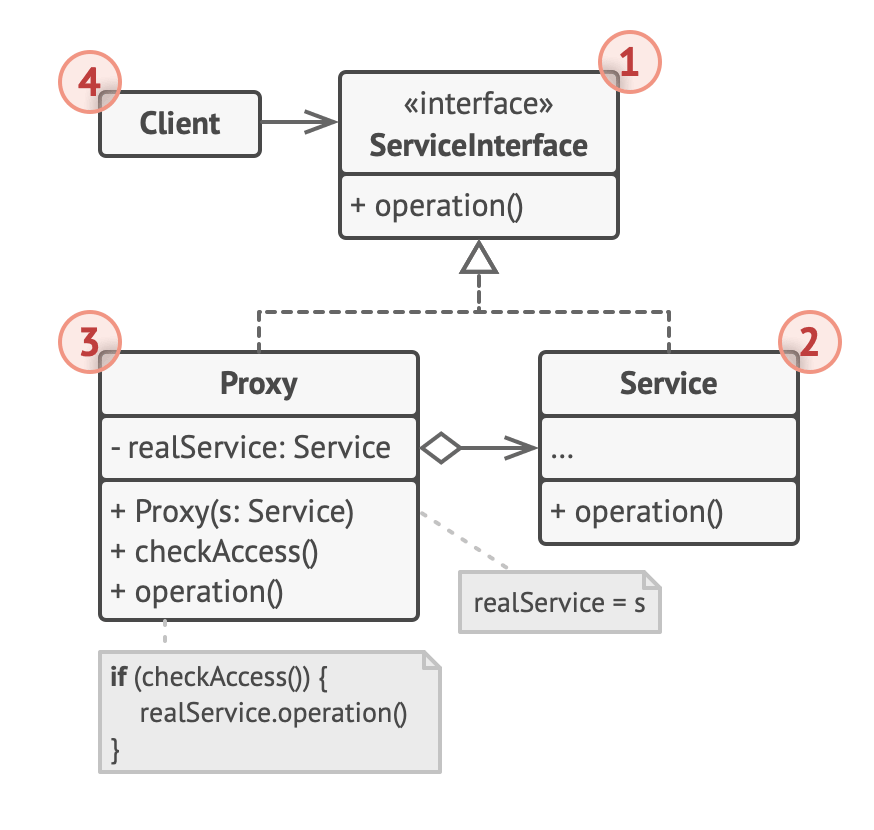

# Proxy

- provide a substitute or placeholder for another object
  - A proxy controls access to the original object, allowing you to perform something either before or after the request gets through to the original object
- In other words by using proxy, one class provides functionality of another class
  - Unlike Decorator, a Proxy usually manages the life cycle of its service object on its own
- allow us to control access to an object
- original definition
  - to provide a surrogate or placeholder for another object to control access to it
    - the surrogate / placeholder is used to access the original object
      - in doing so, the placeholder is able to augment and change the contents of the original object
        - this is often needed to introduce a virtualization layer between the object and the consumer
          - when the consumer requests access to the object, it does so through the proxy
          - the proxy then governs and modifies the data as needed by acting as a wrapper
- important thing is that the interface offered to the consumer remains inline and consistent with the original object
  - can apply a proxy-like behavior by 2 ways
    1. directly augmenting an object during access
    2. through composable wrappers
       - this is better and safer because it does not modify the original object

## typically, this pattern is used when

- need to optimize or preprocessed data when the consumer accesses it
- caching remotely access data
- logging
- encryption
- simulating private and inaccessible properties
- data validation

## Why use a proxy

- use an extra level of indirection to support distributed, controlled, or conditional access
- add a wrapper and delegation to protect the real component from undue complexity

## Structure



1. The Service Interface declares the interface of the Service.

   - The proxy must follow this interface to be able to disguise itself as a service object.

2. The Service is a class that provides some useful business logic.

3. The Proxy class has a reference field that points to a service object.

   - After the proxy finishes its processing (e.g., lazy initialization, logging, access control, caching, etc.), it passes the request to the service object.
   - Usually, proxies manage the full lifecycle of their service objects.

4. The Client should work with both services and proxies via the same interface.
   - This way you can pass a proxy into any code that expects a service object.

## Summary

- the proxy pattern allows us to create placeholder wrappers for objects
- a proxy object allows external access control to the object
- implements the same interface as the original object
- the proxy api (ES6, ES2015) enables the creation of proxy wrappers for objects
- proxy implements traps for various kinds of access augmentation
- great for implementing middleware mechanism for caching, logging, encryption, and other kinds of augmented functionality as a virtualized proxy

## When to apply

- lazy initialization (virtual proxy) of a heavyweight service object that wastes system resources by being always up, but is needed from time to time
  - Instead of creating the object when the app launches, you can delay the object's initialization to a time when it's really needed
- access control (protection proxy)
  - for letting only specific clients to be able to use the service object;
    - for instance, when your objects are crucial parts of an operating system and clients are various launched applications (including malicious ones)
  - The proxy can pass the request to the service object only if the client's credentials match some criteria
- local execution of a remote service (remote proxy)
  - This is when the service object is located on a remote server
  - In this case, the proxy passes the client request over the network, handling all the nasty details of working with the network
- logging requests (logging proxy)
  - This is when you want to keep a history of requests to the service object
  - The proxy can log each request before passing it to the service
- caching request results (caching proxy)
  - This is when you need to cache results of client requests and manage the life cycle of this cache, especially if results are quite large
  - The proxy can implement caching for recurring requests that always yield the same results
  - The proxy may use the parameters of requests as the cache keys

## Pros and Cons

| pros                                                                          | cons                                                                  |
| ----------------------------------------------------------------------------- | --------------------------------------------------------------------- |
| controlling the service object without clients knowing about it               | overcomplicated code since you need to introduce a lot of new classes |
| managing the lifecycle of the service object when clients don't care about it | the response from the service might get delayed                       |
| the proxy works even if the service object isn't ready or is not available    |                                                                       |
| introducing new proxies without changing the service or clients               |                                                                       |

## Example

```js
// Presume we have an input filed with an ID of inputname:
const el = `<input type="text" id="inputname" value="" />`;

// We also have a JS object named myUser with
// an id property which references this input
const myUser = {
  id: "inputname",
  name: "",
};

// Our first objective is to update myUser.name
// when a user changes the input value. This can be achieved
// with an onchange event handler on the field:
(function inputChange(myObject) {
  if (!myObject || !myObject.id) return;

  const input = document.getElementById(myObject.id);

  input.addEventListener("onchange", function (e) {
    myObject.name = input.value;
  });
})(myUser);
```

```js
// create proxy
const myUserProxy = new Proxy(myUser, {
  set: function (target, prop, newValue) {
    if (prop === "name" && target.id) {
      // update object property
      target[prop] = newValue;

      // update input field value
      document.getElementById(target.id).value = newValue;

      return true;
    }

    return false;
  },
});

// set a new name
myUserProxy.name = "Craig";

console.log(myUserProxy.name); // Craig
console.log(document.getElementById("inputname").value);
```
