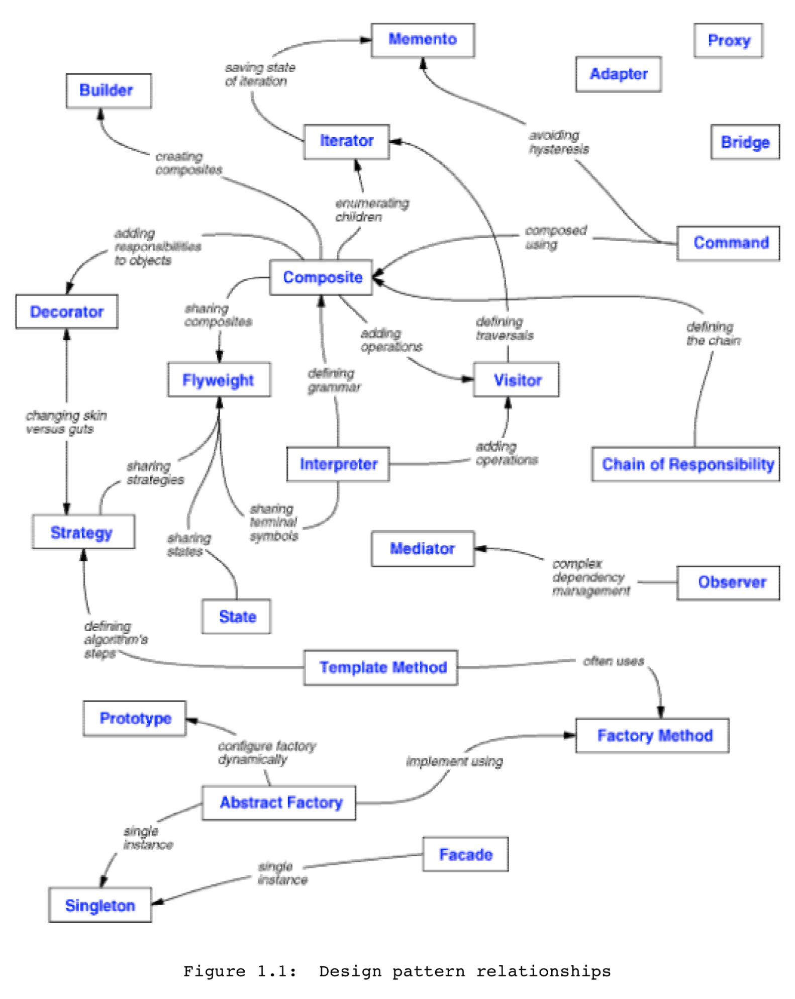

# Design Patterns

- it is a commonly used solution for a specific problem in software design
  - Unlike developed functions or libraries, pattern cannot be just copied to the code
  - It's not an already made piece of software, but a general conception of solution for the problem, which has to be adjusted and implemented in your software
- Patterns are often misconstrued as algorithms, since both concepts represent common solutions of some known issues
  - But algorithm is just a defined set of actions unlike pattern, which is a high-level description of a solution
  - different programs may have their own implementation of this solution
- Design patterns are typically split into 3 categories
  - this is called Gamma Categorization after Erich Gamma, one of GoF authors
- Design should be solve present & future problems & requirements
- Must avoid redesign, or minimize it
- try to reuse existing good solutions than to create new solutions
- What is a DESIGN PATTERN? 1 solution that is able to solve problems a million times over without repetition
  - Has 4 essential elements: pattern name, problem, solution, consequences
    - Pattern Name: A handle used to describe a design problem, solutions, & consequences in a word or two
    - Problem: describes when to apply the patterns
    - Solution: describes the elements that make up the design, relationships, responsibilities, & collaborations
    - Consequences: the results & trade-offs of applying the pattern
- according to the `DESIGN PATTERNS: ELEMENTS OF REUSABLE OBJECT-ORIENTED SOFTWARE` or `Book by the gang of four` there are 23 design patterns
- Hard part about object oriented design is decomposing a system into objects due to many factors:
  - encapsulation, granularity, dependency, flexibility, performance, evolution, reusability ...
- Object oriented design methodologies favor many different approaches
  - write a problem statement, single out nouns and verbs, create corresponding classes and operations
  - Focus on the collaborations & responsibilities in your system
  - Model the real world & translate the objects found during analysis into design

## [Creational Patterns](./Creational_patterns/)

- To do with the process of object creation
- provide a way to create objects while hiding the creation logic, rather than instantiating objects directly using new operator
  - This gives program more flexibility in deciding which objects need to be created for a given use case

### [Abstract Factory](./Creational_patterns/AbstractFactory/readme.md)

### [Builder](./Creational_patterns/Builder/readme.md)

### [Factory Method](./Creational_patterns/Factory/readme.md)

### [Prototype](./Creational_patterns/Prototype/readme.md)

### [Singleton](./Creational_patterns/Singleton/readme.md)

## [Structural Patterns](./Structural_patterns/)

- Deal with the composition of classes or objects
- are related to class and object composition
  - Concept of inheritance is used to compose interfaces and define ways to compose objects to obtain new functionalities

### [Adapter](./Structural_patterns/Adapter/readme.md)

### [Bridge](./Structural_patterns/Bridge/readme.md)

### [Composite](./Structural_patterns/Composite/readme.md)

### [Decorator](./Structural_patterns/Decorator/readme.md)

### [Facade](./Structural_patterns/Facade/readme.md)

### [Flyweight](./Structural_patterns/Flyweight/readme.md)

### [Proxy](./Structural_patterns/Proxy/readme.md)

## [Behavioral Patterns](./Behavioral_patterns/)

- Characterize the ways in which classes or objects interact and distribute responsibility
- are used for efficient and safe communication between objects and distribution of responsibility among them
  - For this purpose, both inheritance and composition-based mechanisms can be used
  - Patterns are software development tools
  - Like real-world tools, that you can simply buy in a hardware store, they have specific purpose and are not equally useful in different scenarios

### [Chain of Responsibility](./Behavioral_patterns/ChainOfResponsibility/readme.md)

### [Command](./Behavioral_patterns/Command/readme.md)

### [Interpreter](./Behavioral_patterns/Interpreter/readme.md)

### [Iterator](./Behavioral_patterns/Iterator/readme.md)

### [Mediator](./Behavioral_patterns/Mediator/readme.md)

### [Memento](./Behavioral_patterns/Memento/readme.md)

### [Observer](./Behavioral_patterns/Observer/readme.md)

### [State](./Behavioral_patterns/State/readme.md)

### [Strategy](./Behavioral_patterns/Strategy/readme.md)

### [Template Method](./Behavioral_patterns/Template/readme.md)

### [Visitor](./Behavioral_patterns/Visitor/readme.md)

## How to select a Design Pattern

1. Consider how design patterns solve design problems
2. Scan intent sections
3. Study how patterns interrelate
4. Study patterns of like purpose
5. Examine a cause of redesign
6. Consider what should be variable in your design
   - this is opposite of focusing on cause of redesign
   - consider what you want to be able to change without redesign, instead of what might force a change to a design
     - the focus is on encapsulating the concept that varies

| Purpose    | Design Pattern          | Aspect(s) that can vary                                                                 |
| ---------- | ----------------------- | --------------------------------------------------------------------------------------- |
| Creational | Abstract Factory        | families of product objects                                                             |
|            | Builder                 | how a composite object gets created                                                     |
|            | Factory Method          | subclass of object that is instantiated                                                 |
|            | Prototype               | class of object that is instantiated                                                    |
|            | Singleton               | the sole instance of a class                                                            |
| Structural | Adapter                 | interface to an object                                                                  |
|            | Bridge                  | implementation to an object                                                             |
|            | Composite               | structure and composition of an object                                                  |
|            | Decorator               | responsibilities of an object without subclassing                                       |
|            | Facade                  | interface to a subsystem                                                                |
|            | Flyweight               | storage costs of objects                                                                |
|            | Proxy                   | how an object is accessed; its location                                                 |
| Behavioral | Chain of Responsibility | object that can fulfill a request                                                       |
|            | Command                 | when and how a request is fulfilled                                                     |
|            | Interpreter             | grammar and interpretation of a language                                                |
|            | Iterator                | how an aggregate's elements are accessed, traversed                                     |
|            | Mediator                | how and which objects interact with each other                                          |
|            | Memento                 | what private information is stored outside an object, and when                          |
|            | Observer                | No. of objects that depend on another object; how the dependent objects stay up to date |
|            | State                   | states of an object                                                                     |
|            | Strategy                | an algorithm                                                                            |
|            | Template Method         | steps of an algorithm                                                                   |
|            | Visitor                 | operations that can be applied to object(S) without changing their class(es)            |

## How to use a Design Pattern

1. Read the pattern once through for an overview
   - pay attention to the Applicability & Consequences section to ensure the pattern is right for the problem
2. Go back & study the Structure, Participants, & Collaborations sections
   - make sure to understand the classes & objects in the pattern & how they related to each other
3. Look at the Sample Code section to see a concrete example of the pattern in code
4. Choose names for pattern participants that are meaningful in the application context
5. Define the classes
   - declare their interfaces,
   - establish their inheritance relationships,
   - define the instance variable that represents data & object references
   - identify existing classes in app that pattern will affect, and modify accordingly
6. Define application specific names for operations in the pattern
   - use the responsibilities & collaboration associated with each operation as a guide
7. Implement the operations to carry out the responsibilities & collaborations in the pattern

- Design patterns should not be applied indiscriminately
- It can complicate design & or cost performance to achieve flexibility & variability by introducing additional levels of indirection
- Design patterns should only be applied when the flexibility is really needed

## How design patterns solve design problems

### Finding appropriate objects

- Hard part about object oriented design is decomposing a system into objects due to many factors:
  - encapsulation, granularity, dependency, flexibility, performance, evolution, reusability ...
- Object oriented design methodologies favor many different approaches
  - write a problem statement, single out nouns and verbs, create corresponding classes and operations
  - Focus on the collaborations & responsibilities in your system
  - Model the real world & translate the objects found during analysis into design
- Many objects in a design come from the analysis model, but often end up with classes that have no counterparts in the real world
  - low-level classes like arrays
  - higher-level classes:
    - Composite pattern:
      - introduces an abstraction for treating objects uniformly that doesn't have a physical counterpart
      - strict modeling of the real world leads to a system that reflects today's realities but not necessarily tomorrow's
      - abstractions that emerge during design are key to making a design flexible
- Design patterns helps you to identify less-obvious abstractions & the objects that can capture them
  - Strategy pattern describes how to implement interchangeable families of algorithms
  - State pattern represents each state of an entity as an object

### Determining object Granularity

- Design patterns can address the issue of objects being able to vary tremendously in size and number
  - Facade pattern: describes how to represent complete subsystems as objects
  - Flyweight pattern: describes how to support huge numbers of objects at the finest granularities
  - Other design patterns describe specific ways of decomposing an object into smaller objects
  - Abstract Factory & Builder patterns: yield objects whose only responsibilities are creating other objects
  - Visitor & Command patterns: yield objects responsible for only implementing a request on anther object or group of object

### Specifying object interfaces

- An object's interface characterizes the complete set of requests that can be sent to the object
- Any request that matches a signature in the object's interface may be sent to the object
  - Interface: the set of all signatures defined by an object's operations
    - Signature: the operation's name, objects taken as parameters, and operation's return value declared by an object during an operation
- Design patterns help to define interfaces by identifying their key elements & data type that get sent across an interface
- Design patterns will also tell you what not to put in the interfaces
  - Memento pattern: describes how to encapsulate & save the internal state of an object to allow object restoration later
    - must define 2 interfaces:
      - a restricted one that lets clients hold & copy mementos
      - a privileged one that only the original object can use to store & retrieve state in the momento
- Design patterns specify relationships between interfaces, by requiring some classes to have similar interfaces or placing constraints on the interfaces of some classes
  - Decorator & Proxy patterns require the interfaces of Decorator & Proxy objects to be identical to the decorated & proxied objects
  - Visitor pattern: visitor interface must reflect all classes of objects that visitors can visit

### Specifying object implementations

- Object's implementation is defined by its class
- The class specifies the object's internal data & representation & defines the operations the object can perform
- Objects are created by instantiating a class (the object is said to be an instance of the class)
  - Instantiating a class allocates storage for the object's internal data (made up of instance variables)
  - Associates the operations with these data
  - many similar instances of an object can be created by instantiating a class
- New classes can be defined in terms of existing classes using inheritance
  - when subclass inherits from parent class, definitions of all data & operations that the class defines are included
  - objects that are instances of the subclass will contain all data defined by the subclass & its parent classes
    - they be able to perform all operations defined by this subclass & its parents
  - Abstract class is one whose main purpose is to define a common interface for its subclasses
    - abstract class will defer some or all of its implementation to operations defined in subclasses
    - hence an abstract class cannot be instantiated
    - abstract operations are operations that an abstract class declares but doesn't implement
      - Concrete classes are classes that aren't abstract
  - Subclasses can refine & redefine behaviors of their parent classes
    - a class may override an operation defined by its parent class
      - overriding gives subclasses a chance to handle requests instead of their parent classes
  - Class inheritance lets you define classes simply by extending other classes
    - Making it easy to define families of objects having related functionality

### Class vs Interface inheritance

- An object's class defines how the object is implemented
  - The class defines the object's internal state & the implementation of its operations
  - Object's type only refers to its interface-the set of requests to which it can respond
    - an object can have many types
    - objects of different classes can have the same type
- An object is an instance of a class also implies that the object supports the interface defined by the class
- Class inheritance vs Interface inheritance (subtyping)
  - Class inheritance defines an object's implementation in terms of another object's implementation
    - it's a mechanism for code & representation sharing
  - Interface inheritance (subtyping) describes when an object can be used in place of another
  - Programming languages don't make the distinction explicit
    - 2 types:
      1. inheritance means both interface and implementation inheritance (C++)
         - standard way to inherit an interface is to inherit publicly from a class that has (pure) virtual member functions
         - pure interface inheritance can be approximated by inheriting publicly from pure abstract classes
         - pure implementation or class inheritance can be approximated with private inheritance
         - manipulate objects through types defined by abstract classes
      2. inheritance means just implementation inheritance
         - can assign instances of any class to a variable
         - as long as those instances support the operation performed on the value of the variable
         - act as if subclasses were subtypes

### Programming to an Interface, not an Implementation

- Polymorphism depends on inheritance's ability to define families of objects with identical interfaces
  - usually by inheriting from an abstract class
- When inheritance is used, all classes derived from an abstract class will share its interface
  - this implies that a subclass merely adds or overrides operations & does not hide operations of the parent class
  - all subclasses can then respond to the requests in the interface of this abstract class
    - making them all subtypes of the abstract class
- 2 benefits to manipulating objects solely in terms of the interface defined by abstract classes:
  1. clients are unaware of specific types of objects they use, as long as object adhere to the interface as expected
  2. clients are unaware of classes that implement these objects, & only know about abstract classes defining the interface
  - this greatly reduces implementation dependencies between subsystems
  - don't declare variables to be instances of particular concrete classes
    - instead, commit only to an interface defined by an abstract class

### Putting reuse mechanisms to work: Favor object composition over class inheritance

- Class inheritance & Object Composition are 2 most common techniques for reusing functionality in object oriented systems
- Inheritance vs Composition
  - Class Inheritance:
    - lets you define the implementation of 1 class in terms of another's
    - white-box reuse: reuse by subclassing
      - "white-box" refers to visibility
        - with inheritance, the internals of parent classes are often visible to subclasses
    - advantages:
      - defined statically at compile time & is straightforward to use
      - makes it easier to modify the implementation being reused
        - when a subclass overrides some but not all operations, it can affect the operations it inherits
    - disadvantages:
      - can't change the implementations inherited from parent classes at run-time
        - because inheritance is defined at compile time
      - parent classes often define at least part of their subclasses' physical representation
        - because inheritance exposes a subclass to details of its parent's implementation,
        - therefore, inheritance breaks encapsulation
          - any change in the parent's implementation will force the subclass to change
            - when implementation becomes bound up with the implementation of its parent class
        - implementation dependencies can cause problems when trying to reuse a subclass
          - should any aspect of the inherited implementation not be appropriate for new problem domains,
          - the parent class must be rewritten or replaced by something more appropriate
          - this dependency limits flexibility & reusability
      - 1 solution: inherit only from abstract classes, since they usually provide little or no implementation
  - Object Composition: an alternative to class inheritance
    - new functionality is obtained by assembling or composing objects to get more complex functionality
    - requires that the objects being composed have well-defined interfaces
    - black-box reuse: reuse by assembling or composing
      - "black-box" refers to visibility
        - no internal details of objects are visible
    - advantages
      - defined dynamically at run time through objects acquiring references to other objects
        - requires objects to respect each others' interfaces
          - which requires carefully designed interfaces that don't stop you from using 1 object with other
        - any object can be replaced at run time by another as long as it has the same type
        - fewer implementation dependencies due to an object's implementation being written in terms of object interfaces
      - helps keep each class encapsulated & focused on 1 task
        - classes & class hierarchies will remain small
        - will be less likely to grow into unmanageable monsters
    - disadvantages
      - don't break encapsulation
        - because objects are accessed solely through their interfaces
      - will have more objects (if fewer classes)
        - system's behavior will depend on their interrelationships instead of being defined in one's class
    - ideally, shouldn't be creating new components to achieve reuse
    - should be able to get all functionality needed just by assembling existing components through object composition

### Delegation

- It is a way of making composition as powerful for reuse as inheritance
- In delegation, 2 objects are involved in handling a request: a receiving object delegates operations to its delegate
  - this is analogous to subclasses deferring requests to parent classes
  - in order to receive the effect similar to inheritance when referring to receiving object through the this (self) variable
    - the receiver passes itself to the delegate to let the delegated operation refer to the receiver
- advantage
  - it makes it easy to compose behaviors at run time & to change the way they're composed
- disadvantage
  - dynamic, highly parameterized software is harder to understand than more static software
  - there are also run time inefficiencies (but human inefficiencies are more important in the long run)
- delegation is a good design choice only when it simplifies more than it complicates
  - effectiveness depends on the context & experience on it
  - delegation works best when it's used in highly stylized ways used in standard patterns
    - State pattern: an object delegates request to a State object that represents its current state
      - purpose is to change the behavior of an object by changing the objects to which it delegates requests
    - Strategy pattern: an object delegates a specific request to an object that represents a strategy for carrying out the request
      - an object will only have 1 state, but it can have many strategies for different requests
      - purpose is to change the behavior of an object by changing the objects to which it delegates requests
    - Visitor pattern: the operation that gets performed on each element of an object structure is always delegated to the Visitor object
  - patterns that use delegation less heavily
    - Mediator pattern: introduces an object to mediate communication between other objects
      - sometimes the Mediator object implements operations by forwarding them to other objects
      - other times, it passes along a reference to itself & thus uses true delegation
    - Chain of Responsibility pattern: handles request by forwarding them from 1 object to another along a chain of objects
      - sometimes this request carries with it a reference to the original object receiving the request (using delegation)
    - Bridge pattern: decouples an abstraction from its implementation
      - if the abstraction & a particular implementation are closely matched,
      - then the abstraction may simply delegate operations to that implementation
- Delegation is an extreme example of object composition
  - it shows that you can always replace inheritance with object composition as a mechanism for code reuse

### Inheritance vs Parameterized types

- Parameterized types: another technique for reusing functionality
  - also known as "generics" and "templates"
  - lets you define a type without specifying all the other types it uses
    - the unspecified types are supplied as parameters at the point of reuse
  - gives us a 3rd way (in addition to class inheritance & object composition) to compose behavior in object oriented systems
  - differences between object composition, class inheritance, and parameterized types
    - object composition allows changes of behavior being composed at run time, but requires indirection & can be less efficient
    - class inheritance lets your provide default implementations for operations & lets subclasses override them
      - can not change at run time
    - parameterized types lets you change the types that a class can use
      - can not change at run time
  - Parametrized types aren't needed in languages that doesn't have compile time type checking

### Relating Run time & Compile time structures

- Run time structure: often bears little resemblance to its code structure
  - it consists of rapidly changing networks of communicating objects
  - Composite pattern & Decorator pattern are useful for building complex run time structures
  - Observer pattern involves run time structures that are often hard to understand unless you know the pattern
  - Chain of Responsibility pattern also results in communication patterns that inheritance doesn't reveal
  - in general, run time structures aren't clear from the code until you understand the patterns
- Compile time structure: code structure is frozen at compile time
  - it consists of classes in fixed inheritance relationships
- Consider the distinction between object aggregation & acquaintance, & how differently they manifest themselves at compile & run times
  - Aggregation: implies that 1 object owns or is responsible for another object
    - implies that an aggregate object & its owner have identical lifetimes
    - aggregation can be implemented by defining member variables that are real instances
    - but is more common to define them as pointers or references to instances
    - tend to be fewer & more permanent than acquaintance
  - Acquaintance: implies that an object merely knows of another object
    - also called as "association" or the "using" relationship
    - acquainted objects may request operations of each other, but are not responsible for each other
    - acquaintance is a weaker relationship than aggregation & suggest much looser coupling between objects
    - acquaintance is implemented with pointers & references
    - made and remade more frequently, sometimes existing only for the duration of an operation
    - more dynamic, making them more difficult to discern in the source code
  - aggregation & acquaintance are often implemented in the same way
  - both are determined more by intent than by explicit language mechanism

### Designing for change

- Key to maximizing reuse lines is in anticipating new requirements & changes to existing requirements
  - and in designing systems that can evolve accordingly
- To design a system that is robust to changes
  - need to consider how the system might need to change over its lifetime
  - a design that doesn't take change into account risks major redesign in the future
  - changes might involve class redefinition & implementation, client modification, & retesting
  - redesign affects many parts of software system, & unanticipated changes are expensive
- Common causes of redesign and design patterns as solutions
  1. Creating an object by specifying a class explicitly
     - this commits you to an implementation than to an interface, thus complicating future changes
     - solution: create objects indirectly
       - Abstract Factory, Factory method, Prototype
  2. Dependence on specific operations
     - this commits you to 1 way of satisfying a request
     - solution: avoid hard coded requests, making it easier to change the way a request gets satisfied at compile and run time
       - Chain of Responsibility, Command
  3. Dependence on hardware & software platform
     - external OS interfaces & APIs are different on different hardware & software platforms
     - software that depends on a particular platform will be harder to port to other platforms
     - difficult to keep it up to data on its native platform
     - solution: important to design the system to limit its platform dependencies
       - Abstract Factory, Bridge
  4. Dependence on object representations or implementations
     - clients knowing how object is represented, stored, located, or implemented might need to be changed when object changes
     - solution: hiding this information from clients keeps changes from cascading
       - Abstract Factory, Bridge, Memento, Proxy
  5. Algorithmic dependencies
     - algorithms are often extended, optimized, and replaced during development & reuse
     - objects that depend on algorithm will have to change when algorithm changes
     - solution: isolate algorithms that are likely to change
       - Builder, Iterator, Strategy, Template Method, Visitor
  6. Tight coupling
     - classes that are tightly coupled are hard to reuse in isolation, since they depend on each other
     - tight coupling leads to monolithic systems, can't change or remove class without understanding & changing other classes
     - System becomes a dense mass that's hard to learn, port, and maintain
     - solution: loose coupling increases the probability that a class can be reused by itself
       - & that a system can be learned, ported, modified, & extended more easily
       - design patterns use techniques such as abstract coupling & layering to promote loosely coupled systems
       - Abstract Factory, Bridge, Chain of Responsibility, Command, Facade, Mediator, Observer
  7. Extending functionality by subclassing
     - customizing an object by subclassing isn't easy as every new class has a fixed implementation overhead
     - defining a subclass also requires an in depth understanding of the parent class
       - overriding 1 operation might require overriding another
       - an overridden operation might be required to call an inherited operation
       - subclassing can lead to an explosion of classes,
       - because you might have to introduce many new subclasses for even a simple extension
     - solution: object composition & delegation provide flexible alternatives to inheritance for combining behavior
       - add new functionality to application by composing existing objects in new ways than defining new subclasses of existing classes
       - heavy use of object composition can make designs harder to understand
         - thus design patterns produce designs where you can introduce customized functionality by defining 1 subclass
         - & composing its instances with existing ones
       - Bridge, Chain of Responsibility, Composite, Decorator, Observer, Strategy
  8. Inability to alter classes conveniently
     - sometimes have to modify a class that can't be modified conveniently
     - might need the source code, but don't have it
     - any change would require modifying lots of existing subclasses
     - solution: Use Adapter, Decorator, Visitor design patterns during such circumstances
- the role design patterns play in the development of 3 broad classes of software: application programs, toolkits, frameworks
  1. Application programs
     - internal reuse, maintainability, & extension are high priorities when building apps: document editor or spreadsheet
       - ensures that you don't design & implement more than you have to
     - design patterns make an app more maintainable when they're used to limit platform dependencies & to layer a system
       - they enhance extensibility by showing you how to extend class hierarchies & how to exploit object composition
  2. Toolkits
     - a set of related & reusable classes designed to provide useful, general purpose functionality
       - e.g.: a set of collection classes for lists, associative tables, stacks
     - toolkit is used by writing the main body of the app & calling the code from the toolkit to reuse
     - it does not impose a particular design on the app
     - it just provide functionality that can help the app do its job
     - it also lets you as an implementer avoid recoding common functionality
     - emphasize on code reuse, are object oriented equivalent of subroutine libraries
     - Toolkit design is harder than app design, as toolkits have to work in many apps to be useful
       - moreover, toolkit writer won't know what the will be or special needs of apps designed by others
       - is important to avoid assumptions & dependencies that limits toolkit's flexibility, applicability & effectiveness
  3. Frameworks
     - it is a set of cooperating classes that make up a reusable design for a specific class of software
       - a framework can be geared toward building graphical editors for different domains
       - another framework can help build compilers for different programming languages & target machines
       - another might help build financial modeling applications
       - A framework can be customized to a particular app
         - by creating app specific subclasses of abstract classes from the framework
     - framework is used by reusing main body & writing the code it calls
       - have to write operations with particular names & calling conventions
       - this reduces the design decisions you have to make
       - framework will allow building of apps faster, but apps will have similar structure
         - easier to maintain, are more consistent to users
         - however, will lose creative freedom, since many design decisions have been made for you
     - framework dictates the architecture of the app
       - it defines the overall structure, its partitioning into classes & objects
       - the key responsibilities: how classes & objects collaborate
       - the thread of control
       - framework predefine the above design parameters so that the designer can focus on specifics of the app
       - framework captures the design decisions that are common to its application domain
       - thus framework emphasize design reuse over code reuse
         - however, framework will usually include concrete subclasses that can be used immediately
       - imperative to design the framework to be a flexible & extensible as possible
     - a framework that addresses loose coupling by using design patterns will achieve high levels of design & code reuse
     - people who know the design patterns the framework uses will gain insight into the framework faster
     - 3 major difference between design patterns and frameworks
       1. Design patterns are more abstract than frameworks
          - frameworks can be embodied in code, but only examples of patterns can be embodied in code
          - adv of framework is that they can be written down in programming languages
            - & can be studied, executed, & reused directly
          - design patterns have to be implemented each time they're used
            - it also explain the intent, trade-offs, & consequences of a design
       2. Design patterns are smaller architectural elements than frameworks
          - a typical framework contains several design patterns, but the reverse is never true
       3. Design patterns are less specialized than frameworks
          - frameworks always have a particular application domain
            - a graphical editor framework used in factory simulation, won't be mistaken for a simulation framework
          - design patterns can be used in nearly any kind of application
            - although specialized design patterns are possible, it won't dictate an app architecture like a framework
     - frameworks are becoming important to allow object oriented systems to achieve the most reuse
